Exploring bacterial-viral dynamics in seagrass associated metagenomes
================
Cassie Ettinger

## Load libraries and set-up analysis

``` r
# Load libraries

library(GGally)
library(tidyverse)
library(network)
library(vroom)
library(phyloseq)
library(patchwork)
library(microbiome)
```

## Preprocessing viral data

``` r
# Load in vContact2 data
genome.ov <- read.table("../data/vcontact2/genome_by_genome_overview.csv",
    header = T, sep = ",")  #results from vcontact2
ntwk <- read.table("../data/vcontact2/c1.ntw", header = F, sep = " ",
    col.names = c("OTU1", "OTU2", "Score"))  #network from vcontact2
ictv_names <- vroom("../data/vcontact2/1Aug2022_data.tsv")

samples <- c("Ettinger", "Crump", "Cucio", "Fraser", "Fraser2023",
    "Miranda", "Mohr", "Rubio_Protillo", "Schorn", "Sogin", "SoginMETA")

# Define the source of each vOTU, either SG or from the
# reference database refseq
genome.ov <- genome.ov %>%
    mutate(Source = ifelse(str_detect(Genome, paste(samples,
        collapse = "|")), "SG", "refseq")) %>%
    select(-Genus, -Order, -Family)

genome.ov <- left_join(genome.ov, ictv_names, by = c(Genome = "Accession"))


# Check that # contigs matches number expected vOTUs (3633)
# genome.ov %>% filter(Source == 'SG') %>% group_by(Genome)
# %>% count()

# Generate a data frame that specifies the composition of
# each viral cluster in terms of source of network nodes
# (ie. does the cluster have sequences from seagrass?)
# ClstrComp = cluster composition, either from seagrass
# (SG), reference data(refseq) or both
clstr.source <- genome.ov %>%
    filter(VC.Status == "Clustered") %>%
    filter(VC != "nan") %>%
    mutate(SG = str_detect(Genome, paste(samples, collapse = "|"))) %>%
    group_by(VC, Size) %>%
    summarise(pSG = sum(SG)/n()) %>%
    mutate(ClstrComp = case_when(pSG == 0 ~ "refseq", pSG ==
        1 ~ "SG", TRUE ~ "both"))

# Let's create a data frame with the consensus viral
# taxonomy for each cluster.  the strategy is to check each
# taxonomic rank and see if there's only one assignment or
# a mix.  Some refseq entrees have unassigned ranks so we
# are ignoring those and deciding the proper classification
# based on the rest of the VC members Ultimately we'll
# combine this approach with genomad which may be more
# accurate

clstr.order <- genome.ov %>%
    filter(VC.Status == "Clustered") %>%
    filter(VC != "nan") %>%
    filter(ICTV_Order != "Unclassified") %>%
    filter(!is.na(ICTV_Order)) %>%
    group_by(VC, ICTV_Order) %>%
    count() %>%
    group_by(VC) %>%
    mutate(Duplicates = n()) %>%
    mutate(Order = ifelse(Duplicates > 1, "Unclassified", as.character(ICTV_Order))) %>%
    group_by(VC, Order) %>%
    count() %>%
    select(-n)

clstr.family <- genome.ov %>%
    filter(VC.Status == "Clustered") %>%
    filter(VC != "nan") %>%
    filter(ICTV_Family != "Unclassified") %>%
    filter(!is.na(ICTV_Family)) %>%
    group_by(VC, ICTV_Family) %>%
    count() %>%
    group_by(VC) %>%
    mutate(Duplicates = n()) %>%
    mutate(Family = ifelse(Duplicates > 1, "Unclassified", as.character(ICTV_Family))) %>%
    group_by(VC, Family) %>%
    count() %>%
    select(-n)

clstr.genus <- genome.ov %>%
    filter(VC.Status == "Clustered") %>%
    filter(VC != "nan") %>%
    filter(ICTV_Genus != "Unclassified") %>%
    filter(!is.na(ICTV_Genus)) %>%
    group_by(VC, ICTV_Genus) %>%
    count() %>%
    group_by(VC) %>%
    mutate(Duplicates = n()) %>%
    mutate(Genus = ifelse(Duplicates > 1, "Unclassified", as.character(ICTV_Genus))) %>%
    group_by(VC, Genus) %>%
    count() %>%
    select(-n)

clstr.phyla <- genome.ov %>%
    filter(VC.Status == "Clustered") %>%
    filter(VC != "nan") %>%
    filter(ICTV_Phylum != "Unclassified") %>%
    filter(!is.na(ICTV_Phylum)) %>%
    group_by(VC, ICTV_Phylum) %>%
    count() %>%
    group_by(VC) %>%
    mutate(Duplicates = n()) %>%
    mutate(Phylum = ifelse(Duplicates > 1, "Unclassified", as.character(ICTV_Phylum))) %>%
    group_by(VC, Phylum) %>%
    count() %>%
    select(-n)

clstr.class <- genome.ov %>%
    filter(VC.Status == "Clustered") %>%
    filter(VC != "nan") %>%
    filter(ICTV_Class != "Unclassified") %>%
    filter(!is.na(ICTV_Class)) %>%
    group_by(VC, ICTV_Class) %>%
    count() %>%
    group_by(VC) %>%
    mutate(Duplicates = n()) %>%
    mutate(Class = ifelse(Duplicates > 1, "Unclassified", as.character(ICTV_Class))) %>%
    group_by(VC, Class) %>%
    count() %>%
    select(-n)

# Combine results
clstr.master <- clstr.source %>%
    left_join(clstr.order, by = "VC") %>%
    left_join(clstr.family, by = "VC") %>%
    left_join(clstr.genus, by = "VC") %>%
    left_join(clstr.phyla, by = "VC") %>%
    left_join(clstr.class, by = "VC") %>%
    mutate(Order = ifelse(is.na(Order), "Unassigned", Order)) %>%
    mutate(Family = ifelse(is.na(Family), "Unassigned", Family)) %>%
    mutate(Genus = ifelse(is.na(Genus), "Unassigned", Genus)) %>%
    mutate(Phylum = ifelse(is.na(Phylum), "Unassigned", Phylum)) %>%
    mutate(Class = ifelse(is.na(Class), "Unassigned", Class))

# Make a taxonomy table for phyloseq
genome.SG <- genome.ov[which(genome.ov$Source == "SG"), ]

genome.SG <- genome.SG[-c(1, 5, 16:53)]

# Join the taxonomy back to the main cluster dataset
genome.SG.tax <- left_join(genome.SG, clstr.master, by = "VC")

# Edit taxonomy a bit more for use in plots
genome.SG.tax <- genome.SG.tax %>%
    mutate(ClusterStatus = ifelse(is.na(Size), "Unclustered",
        "Clustered")) %>%
    mutate(Phylum = ifelse(is.na(Phylum), "Unassigned", Phylum)) %>%
    mutate(Class = ifelse(is.na(Class), "Unassigned", Class)) %>%
    mutate(Order = ifelse(is.na(Order), "Unassigned", Order)) %>%
    mutate(Family = ifelse(is.na(Family), "Unassigned", Family)) %>%
    mutate(Genus = ifelse(is.na(Genus), "Unassigned", Genus))

genome.SG.justtax <- genome.SG.tax[-c(4:15)]

# Select only the columns we need moving forward
genome.SG.justtax <- genome.SG.justtax %>%
    select(Genome, ClstrComp, VC.Status, Phylum, Class, Order,
        Family, Genus, VC)

# save all the files we made above
saveRDS(genome.ov, "../results/genome_vc_master_ictv.RDS")
write_csv(genome.ov, "../results/genome_vc_master_ictv.csv")

saveRDS(clstr.master, "../results/cluster_vc_master_ictv.RDS")
write_csv(clstr.master, "../results/cluster_vc_master_ictv.csv")

saveRDS(genome.SG.justtax, "../results/tax_vc_phyloseq_ictv.RDS")
write_csv(genome.SG.justtax, "../results/tax_vc_phyloseq_ictv.csv")
```

``` r
# genomad on sequences
genomad <- vroom("../data/genomad_tax/dRep_clustered_taxonomy.tsv")

# separate taxonomy
genomad <- genomad %>%
    separate_wider_delim(cols = lineage, delim = ";", names = c("Domain",
        "Realm", "Kingdom", "Phylum", "Class", "Order", "Family"),
        too_few = "align_start")

genomad.tax <- genomad[-c(2, 3, 4)]

mixed.tax <- left_join(genome.SG.justtax[-c(4:8)], genomad.tax,
    by = c(Genome = "seq_name")) %>%
    mutate(Order = ifelse(is.na(Order), "Unclassified", Order)) %>%
    mutate(Family = ifelse(is.na(Family), "Unclassified", Family)) %>%
    mutate(Phylum = ifelse(is.na(Phylum), "Unclassified", Phylum)) %>%
    mutate(Class = ifelse(is.na(Class), "Unclassified", Class))

rownames(mixed.tax) <- mixed.tax$Genome

# We are using genomad taxonomy and then VC's but not the
# cluster membership method
mixed.tax <- mixed.tax %>%
    select(Genome, VC.Status, Realm, Kingdom, Phylum, Class,
        Order, Family, VC) %>%
    mutate(Realm = ifelse(is.na(Realm), "Unclassified", Realm),
        Kingdom = ifelse(is.na(Kingdom), "Unclassified", Kingdom))

saveRDS(mixed.tax, "../results/tax_genomad_phyloseq_ictv.RDS")
write_csv(mixed.tax, "../results/tax_genomad_phyloseq_ictv.csv")

mixed.tax.7levels <- mixed.tax %>%
    select(-Kingdom)

saveRDS(mixed.tax.7levels, "../results/tax_genomad_phyloseq_ictv_7lev.RDS")
write_csv(mixed.tax.7levels, "../results/tax_genomad_phyloseq_ictv_7lev.csv")
```

``` r
# vcontact2 also makes a network of protein similarity it
# uses this to make VCs we can use this to plot viruses and
# color by taxonomy or host or genome quality first we need
# to import network info into R and save as R-readable
# files get network information - too big these steps done
# on cluster
nodes <- ggnet2(ntwk[, -3], mode = "fruchtermanreingold", layout.par = list(list = (niter = 2000)))$data %>%
    rename(Genome = "label")

edges <- ntwk %>%
    mutate(Pair = paste(OTU1, OTU2, sep = ".")) %>%
    gather(key = "Member", value = "Genome", -Pair, -Score) %>%
    inner_join(nodes, by = "Genome")

# save files for later
saveRDS(nodes, "../results/ntwk_nodes.RDS")
saveRDS(edges, "../results/ntwk_edges.RDS")
```

``` r
# Import data for phyloseq
tpmean.75 <- vroom("../data/coverm_relative_abundance/votu.tmean.tsv")
meta <- read.csv("../data/vOTU_metadata.csv")
tax <- readRDS("../results/tax_genomad_phyloseq_ictv_7lev.RDS")

rownames(meta) <- meta$SampleID

tpmean.75 <- tpmean.75 %>%
    arrange(Contig)
tpmean.75 <- as.data.frame(tpmean.75)
rownames(tpmean.75) <- tpmean.75$Contig

tax <- tax %>%
    arrange(Genome)
rownames(tax) <- tax$Genome

tax.mat <- as.matrix(tax[-c(1)])

# Import into phyloseq and rename to vOTU names
otu_tab = otu_table(tpmean.75[-c(1)], taxa_are_rows = TRUE)
mapping_file = sample_data(meta)
tax_file = tax_table(tax.mat)

vOTU.names <- as.data.frame(rownames(otu_tab))
vOTU.names$votu.id <- paste0("vOTU", 1:nrow(vOTU.names))

# Rename votus
rownames(otu_tab) <- paste0("vOTU", 1:nrow(otu_tab))
rownames(tax_file) <- paste0("vOTU", 1:nrow(tax_file))

# Load into phyloseq
ps <- phyloseq(otu_tab, tax_file, mapping_file)
# 86 samples

# Remove empty samples
ps <- prune_samples(sample_sums(ps) > 0, ps)
# 67 samples
```

``` r
# Pre-processing CheckV / DRAM results

# Connect CheckV results for each viral genome back to vOTUs and to VCs 

# Combine individual CheckV file and connect to 'Genome' name used in VContact2 results
CV_data_path <- "../data/checkV_results/"   # path to the data
CV_files <- dir(CV_data_path, pattern = "*.tsv") # get file names

CV_data <- data_frame(filename = CV_files) %>%
  mutate(file_contents = map(filename,          
                             ~ read_tsv(file.path(CV_data_path, .))) # a new data column
  )  

# Un-nest the data
CV_data_un <- unnest(CV_data, cols = c(file_contents))

# Clean up names
CV_data_un <- CV_data_un %>% 
  mutate_at("filename", str_replace, "_megahit_coassembly.checkv.quality_summary.tsv", "") %>%
  mutate_at("filename", str_replace, "Cassie_seagrass_metagenome_chytrids_coassembly.checkv.quality_summary.tsv", "Ettinger")

CheckV_results <- CV_data_un %>%
  mutate(Genome = paste0(filename, "_", contig_id)) %>%
  separate_wider_delim(Genome, delim = "|", names = c("GenomeID"), too_many = "drop")

saveRDS(CheckV_results, "../results/checkv_results.RDS")
write_csv(CheckV_results, "../results/checkv_results.csv")

# Get cluster membership information from dRep, to connect to vOTUs
drep <- vroom("../data/dRep_votus/Cdb.csv")
drep_reps <- vroom("../data/dRep_votus/Widb.csv")

drep <- drep %>%
  mutate_at("genome", str_replace, ".fa", "") %>%
  select(genome, secondary_cluster)

drep_reps <- drep_reps %>%
  mutate_at("genome", str_replace, ".fa", "") %>%
  mutate(Representative = TRUE) %>%
  select(genome, Representative)

# Combine with CheckV results
checkv_dRep <- left_join(CheckV_results, drep, by = c("GenomeID" ="genome")) %>%
  left_join(drep_reps, by = c("GenomeID" ="genome"))

saveRDS(checkv_dRep, "../results/checkv_drep_results.RDS")
write_csv(checkv_dRep, "../results/checkv_drep_results.csv")

# Subset to get rep seqs for each cluster, 
# combine with taxonomy from VC/genomad  
# and then remove genome ID and extra info
# then combine back based on dRep clstr # to get taxonomy for all 

checkv_dRep_rep <- checkv_dRep %>% 
  filter(Representative == TRUE)

checkv_drep_rep_tax <- left_join(checkv_dRep_rep, mixed.tax, by=c("GenomeID" = "Genome"))


## ADD votu ids

# Load from phyloseq file

#vOTU.names

vOTU.names$Genome = vOTU.names$`rownames(otu_tab)`

vOTUs.ids.for.join <- vOTU.names[-c(1)]

checkv_drep_rep_tax_votu <- left_join(checkv_drep_rep_tax, vOTUs.ids.for.join, by=c("GenomeID" = "Genome"))

checkv_drep_rep_tax_cltr <- checkv_drep_rep_tax_votu %>% 
  select(secondary_cluster, votu.id, VC.Status, Realm,
         Kingdom, Phylum, Class, Order, Family, VC)

checkv_dRep_tax <- left_join(checkv_dRep, checkv_drep_rep_tax_cltr)

saveRDS(checkv_dRep_tax, "../results/checkv_drep_results_with_tax_ictv.RDS")
write_csv(checkv_dRep_tax, "../results/checkv_drep_results_with_tax_ictv.csv")


## note DRAM files have different viral contig names 

# Combine DRAM distill quality info 
DD_data_path <- "../data/dramv_results/"   # path to the data
DMAG_files <- dir(DD_data_path, pattern = "*.vMAG_stats.tsv") # get file names


DMAG_data <- data_frame(filename = DMAG_files) %>% 
  mutate(file_contents = map(filename,         
                             ~ read_tsv(file.path(DD_data_path, .))) # a new data column
  )  

DMAG_data_un <- unnest(DMAG_data, cols = c(file_contents))

# Fix names
DMAG_data_un <- DMAG_data_un %>% 
  mutate_at("filename", str_replace, "_megahit_coassembly_dramv-distill_vMAG_stats.tsv", "") %>%
  mutate_at("filename", str_replace, "Cassie_seagrass_metagenome_chytrids_coassembly_dramv-distill_1000_vMAG_stats.tsv", "Ettinger") %>%
  mutate_at("filename", str_replace, "Cassie_seagrass_metagenome_chytrids_coassembly_dramv-distill_2000_vMAG_stats.tsv", "Ettinger") %>%
  mutate_at("filename", str_replace, "Cassie_seagrass_metagenome_chytrids_coassembly_dramv-distill_3000_vMAG_stats.tsv", "Ettinger") %>%
  mutate_at("filename", str_replace, "Cassie_seagrass_metagenome_chytrids_coassembly_dramv-distill_4000_vMAG_stats.tsv", "Ettinger") %>%
  mutate_at("filename", str_replace, "Cassie_seagrass_metagenome_chytrids_coassembly_dramv-distill_4272_vMAG_stats.tsv", "Ettinger") %>%
  mutate_at("filename", str_replace, "Schorn_megahit_coassembly_dramv-distill_0_vMAG_stats.tsv", "Schorn") %>%
  mutate_at("filename", str_replace, "Schorn_megahit_coassembly_dramv-distill_1000_vMAG_stats.tsv", "Schorn") %>%
  mutate_at("filename", str_replace, "Schorn_megahit_coassembly_dramv-distill_2000_vMAG_stats.tsv", "Schorn") %>%
  mutate_at("filename", str_replace, "SoginMETA_megahit_coassembly_dramv-distill_0_vMAG_stats.tsv", "SoginMETA") %>%
  mutate_at("filename", str_replace, "SoginMETA_megahit_coassembly_dramv-distill_1000_vMAG_stats.tsv", "SoginMETA") %>%
  mutate_at("filename", str_replace, "SoginMETA_megahit_coassembly_dramv-distill_2000_vMAG_stats.tsv", "SoginMETA") %>%
  mutate_at("filename", str_replace, "SoginMETA_megahit_coassembly_dramv-distill_3000_vMAG_stats.tsv", "SoginMETA") %>%
  mutate_at("filename", str_replace, "SoginMETA_megahit_coassembly_dramv-distill_4000_vMAG_stats.tsv", "SoginMETA") %>%
  mutate_at("filename", str_replace, "SoginMETA_megahit_coassembly_dramv-distill_5000_vMAG_stats.tsv", "SoginMETA") 

DMAG_data_un <- DMAG_data_un %>% 
  separate_wider_delim("...1", delim = "__", names = c("Genome"), too_many = "drop") %>%
  mutate(Genome = paste0(filename, '_', Genome))

saveRDS(DMAG_data_un[-c(1)], "../results/dram_vmag_stats.RDS")
write_csv(DMAG_data_un[-c(1)], "../results/dram_vmag_stats.csv")


dram_vmag_stats <- left_join(checkv_dRep_tax, DMAG_data_un[-c(1)], by = c("GenomeID"= "Genome"))

saveRDS(dram_vmag_stats, "../results/checkv_dram_vmag_stats_with_tax.RDS")
write_csv(dram_vmag_stats, "../results/checkv_dram_vmag_stats_with_tax.csv")


# Combine DRAM distill AMG info 

DD_data_path <- "../data/dramv_results/"   # path to the data
DAMG_files <- dir(DD_data_path, pattern = "*amg_summary.tsv") # get file names


DAMG_data <- data_frame(filename = DAMG_files) %>% # create a data frame
  mutate(file_contents = map(filename,          # read files into
                             ~ read_tsv(file.path(DD_data_path, .)) %>% mutate(auxiliary_score = as.character(auxiliary_score)))) 

# Un-nest
DAMG_data_un <- unnest(DAMG_data, cols = c(file_contents))

# Fix names
DAMG_data_un <- DAMG_data_un %>% 
  mutate_at("filename", str_replace, "_megahit_coassembly_dramv-distill_amg_summary.tsv", "") %>%
  mutate_at("filename", str_replace, "Cassie_seagrass_metagenome_chytrids_coassembly_dramv-distill_1000_amg_summary.tsv", "Ettinger") %>%
  mutate_at("filename", str_replace, "Cassie_seagrass_metagenome_chytrids_coassembly_dramv-distill_2000_amg_summary.tsv", "Ettinger") %>%
  mutate_at("filename", str_replace, "Cassie_seagrass_metagenome_chytrids_coassembly_dramv-distill_3000_amg_summary.tsv", "Ettinger") %>%
  mutate_at("filename", str_replace, "Cassie_seagrass_metagenome_chytrids_coassembly_dramv-distill_4000_amg_summary.tsv", "Ettinger") %>%
  mutate_at("filename", str_replace, "Cassie_seagrass_metagenome_chytrids_coassembly_dramv-distill_4272_amg_summary.tsv", "Ettinger") %>%
  mutate_at("filename", str_replace, "Schorn_megahit_coassembly_dramv-distill_0_amg_summary.tsv", "Schorn") %>%
  mutate_at("filename", str_replace, "Schorn_megahit_coassembly_dramv-distill_1000_amg_summary.tsv", "Schorn") %>%
  mutate_at("filename", str_replace, "Schorn_megahit_coassembly_dramv-distill_2000_amg_summary.tsv", "Schorn") %>%
  mutate_at("filename", str_replace, "SoginMETA_megahit_coassembly_dramv-distill_0_amg_summary.tsv", "SoginMETA") %>%
  mutate_at("filename", str_replace, "SoginMETA_megahit_coassembly_dramv-distill_1000_amg_summary.tsv", "SoginMETA") %>%
  mutate_at("filename", str_replace, "SoginMETA_megahit_coassembly_dramv-distill_2000_amg_summary.tsv", "SoginMETA") %>%
  mutate_at("filename", str_replace, "SoginMETA_megahit_coassembly_dramv-distill_3000_amg_summary.tsv", "SoginMETA") %>%
  mutate_at("filename", str_replace, "SoginMETA_megahit_coassembly_dramv-distill_4000_amg_summary.tsv", "SoginMETA") %>%
  mutate_at("filename", str_replace, "SoginMETA_megahit_coassembly_dramv-distill_5000_amg_summary.tsv", "SoginMETA") 

DAMG_data_un <- DAMG_data_un %>% 
  separate_wider_delim("scaffold", delim = "__", names = c("Genome"), too_many = "drop") %>%
  mutate(Genome = paste0(filename, '_', Genome))

saveRDS(DAMG_data_un, "../results/dram_amg_results.RDS")
write_csv(DAMG_data_un, "../results/dram_amg_results.csv")

### Virsorter boundaries

VS_data_path <- "../data/virsorter2/"   # path to the data
VS_files <- dir(VS_data_path, pattern = "*.final-viral-score.tsv") # get file names

VS_data <- data_frame(filename = VS_files) %>% # create a data frame
  mutate(file_contents = map(filename,          # read files into
                             ~ read_tsv(file.path(VS_data_path, .))))

# Un-nest
VS_data_un <- unnest(VS_data, cols = c(file_contents))

# Fix names
VS_data_un <- VS_data_un %>%
  mutate_at("filename", str_replace, ".final-viral-score.tsv", "") %>%
  mutate_at("filename", str_replace, "_megahit_coassembly_vs2", "") %>%
  mutate_at("filename", str_replace, "Cassie_seagrass_metagenome_chytrids_coassembly_vs2", "Ettinger")


VS_data_un <- VS_data_un %>%
  separate_wider_delim("seqname", delim = "||", names = c("Genome"), too_many = "drop") %>%
  mutate(Genome = paste0(filename, "_", Genome))

saveRDS(VS_data_un, "../results/virsorter_score_results.RDS")
write_csv(VS_data_un, "../results/virsorter_score_results.csv")


# Combine results

checkv_dRep_tax_combo <- checkv_dRep_tax %>% 
  left_join(VS_data_un, by=c("GenomeID" = "Genome")) %>%
  left_join(DMAG_data_un[-c(1)], by = c("GenomeID" = "Genome"))

saveRDS(checkv_dRep_tax_combo, "../results/combined_results.RDS")
write_csv(checkv_dRep_tax_combo, "../results/combined_results.csv")


checkv_dRep_tax_combo_high <- checkv_dRep_tax_combo %>%
  filter(checkv_quality %in% c("Medium-quality", "High-quality", "Complete")) %>%
  filter(contig_length >= 10000) %>%
  filter(max_score_group != "NCLDV") %>%
  filter(!is.na(votu.id))

saveRDS(checkv_dRep_tax_combo_high, "../results/checkv_dRep_tax_combo_high.RDS")
write_csv(checkv_dRep_tax_combo_high, "../results/checkv_dRep_tax_combo_high.csv")

### iHop predictions
host_predictions <- vroom("../data/iHop_predictions/Host_prediction_to_genome_m90.csv")
host_predictions_genus <- vroom("../data/iHop_predictions/Host_prediction_to_genus_m90.csv")
mag_info <- vroom("../data/mag_metadata.csv")

host_predictions_genus <- host_predictions_genus %>%
  separate_wider_delim(cols= `Host genus`, delim = ";", names = c("Host_Domain", "Host_Phylum","Host_Class","Host_Order","Host_Family","Host_Genus"), too_few = "align_start") %>%
  mutate_at("Host_Phylum", str_replace, "p__", "") %>%
  mutate_at("Host_Class", str_replace, "c__", "") %>%
  mutate_at("Host_Order", str_replace, "o__", "") %>%
  mutate_at("Host_Family", str_replace, "f__", "") %>%
  mutate_at("Host_Genus", str_replace, "g__", "") 


host_predictions <- host_predictions %>%
  mutate_at("Host genome", str_replace, "-contigs", "") %>%
  mutate_at("Host genome", str_replace, ".cleaned", "") %>%
  mutate_at("Host genome", str_replace, "_1", "") %>%
  mutate(Source = ifelse(str_detect(`Host genome`, "RS_"), "Reference", 
                         ifelse(str_detect(`Host genome`, "GB_"), "Reference",
                                ifelse(str_detect(`Host genome`, "^\\d+"), "Reference", "This study")))) %>%
  left_join(mag_info, by=c(`Host genome`= 'binID'))
```

## Plotting

``` r
# Network plotting

# Load in network files
nodes <- readRDS("../results/ntwk_nodes.RDS")
edges <- readRDS("../results/ntwk_edges.RDS")
genome.ov <- readRDS("../results/genome_vc_master_ictv.RDS")
genome.SG.justtax <- readRDS("../results/tax_vc_phyloseq_ictv.RDS")

clstrd.nodes <- nodes %>%
    left_join(genome.ov, by = "Genome") %>%
    filter(VC.Status == "Clustered")

# Can plot networks based on vcontact2

v.ids <- genome.SG.justtax$Genome

# Network plot just highlighting nodes from this study
ntwk.p <- clstrd.nodes %>%
    ggplot(aes(x, y)) + geom_line(data = filter(edges, Genome %in%
    clstrd.nodes$Genome), aes(group = Pair), color = "gray25",
    size = 0.5, alpha = 0.1) + geom_point(alpha = 0.8, size = 2,
    shape = 16, aes(color = Source)) + scale_color_manual(name = "Source",
    values = c("gray", RColorBrewer::brewer.pal(9, "Blues")[6]),
    labels = c(refseq = "Reference", SG = "This study")) + theme_minimal() +
    theme(text = element_text(size = 16), axis.text = element_blank(),
        axis.title = element_blank(), panel.grid = element_blank(),
        legend.position = "right")

ntwk.p
```

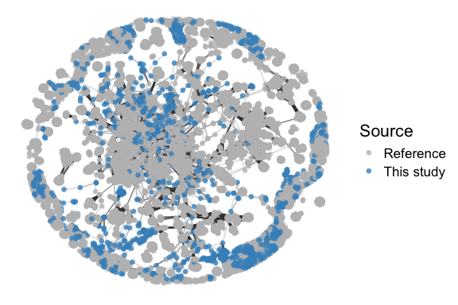<!-- -->

``` r
# Host plot
host_plot <- checkv_dRep_tax_combo_high %>%
    left_join(host_predictions_genus, by = c(GenomeID = "Virus")) %>%
    # left_join(host_predictions, by=c('GenomeID' =
    # 'Virus')) %>%
filter(!is.na(Host_Class)) %>%
    select(Host_Class, GenomeID) %>%
    unique() %>%
    group_by(Host_Class) %>%
    tally() %>%
    # mutate(Host_Class = ifelse(is.na(Host_Class),
    # 'Unpredicted', as.character(Host_Class))) %>%
arrange(desc(n)) %>%
    group_by(Host_Class) %>%
    mutate(n2 = sum(n)) %>%
    mutate(lab_ypos = n2 + 0.2) %>%
    ggplot(aes(x = Host_Class, fill = Host_Class, y = n)) + theme_bw() +
    geom_bar(stat = "identity", position = "stack", width = 0.6) +
    scale_fill_viridis_d(option = "B") + ylab("Number of viral sequences") +
    xlab("") + theme(legend.position = "none") + coord_flip() +
    scale_x_discrete(limits = rev) + geom_text(aes(y = lab_ypos,
    label = n, group = Host_Class), fontface = "bold", size = 4,
    color = "black") + theme(text = element_text(size = 16))


host_plot
```

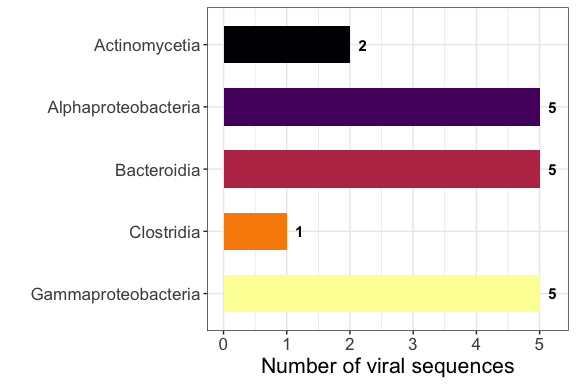<!-- -->

``` r
# AMG plots

DAMG_data_un_HQ <- DAMG_data_un %>%
    filter(Genome %in% checkv_dRep_tax_combo_high$GenomeID)

# this has all annotations for a gene - so can have
# multiple annotations, we need to address or we will be
# over-counting
DAMG_data_un_HQ_counts <- DAMG_data_un_HQ %>%
    count(gene)

DAMG_data_un_HQ <- left_join(DAMG_data_un_HQ, DAMG_data_un_HQ_counts)

DAMG_data_un_HQ.singleAnnot <- DAMG_data_un_HQ %>%
    group_by(filename, gene) %>%
    slice(1)

AMGs <- left_join(DAMG_data_un_HQ.singleAnnot, checkv_dRep_tax_combo_high,
    by = c(Genome = "GenomeID"))

amg.plotdata <- AMGs %>%
    mutate(category = fct_explicit_na(category, na_level = "Unannotated"),
        module = fct_explicit_na(module, na_level = "Unannotated"),
        header = ifelse(category == "Transporters", "Transporters",
            as.character(header)), header = fct_explicit_na(header,
            na_level = "Unannotated"), category = ifelse(category ==
            "carbon utilization (Woodcroft)", "carbon utilization",
            as.character(category)), header = ifelse(header ==
            "sugar utilization (woodcroft)", "carbon utilization",
            as.character(header)), category = ifelse(category ==
            "MISC", "Information Systems", as.character(category)),
        category = ifelse(category == "carbon utilization", "Carbon Utilization",
            as.character(category))) %>%
    group_by(category, header, module) %>%
    tally() %>%
    mutate(category = ifelse(category == "Unannotated", "No Classification",
        as.character(category))) %>%
    mutate(category = factor(category, levels = c("Carbon Utilization",
        "Organic Nitrogen", "Information Systems", "Transporters",
        "Energy", "No Classification")))

amg_general <- AMGs %>%
    mutate(category = fct_explicit_na(category, na_level = "Unannotated"),
        module = fct_explicit_na(module, na_level = "Unannotated"),
        header = ifelse(category == "Transporters", "Transporters",
            as.character(header)), header = fct_explicit_na(header,
            na_level = "Unannotated"), category = ifelse(category ==
            "carbon utilization (Woodcroft)", "carbon utilization",
            as.character(category)), header = ifelse(header ==
            "sugar utilization (woodcroft)", "carbon utilization",
            as.character(header)), category = ifelse(category ==
            "MISC", "Information Systems", as.character(category)),
        category = ifelse(category == "carbon utilization", "Carbon Utilization",
            as.character(category))) %>%
    group_by(category) %>%
    tally() %>%
    arrange(desc(n)) %>%
    mutate(lab_ypos = n * 1.05 + 4) %>%
    ggplot(aes(x = category, fill = category, y = n)) + theme_bw() +
    geom_bar(stat = "identity", position = "stack", width = 0.6) +
    coord_flip() + scale_fill_viridis_d(option = "G", direction = -1) +
    ylab("Number of auxillary metabolic genes") + xlab("") +
    theme(legend.position = "none") + scale_x_discrete(limits = rev) +
    geom_text(aes(y = lab_ypos, label = n, group = category),
        fontface = "bold", size = 4, color = "black") + theme(text = element_text(size = 16))


amg_general
```

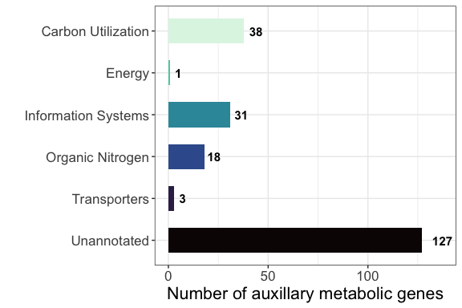<!-- -->

``` r
amg_cazy <- amg.plotdata %>%
    filter(category == "Carbon Utilization") %>%
    arrange(desc(n)) %>%
    mutate(lab_ypos = n * 1.05 + 1) %>%
    ggplot(aes(x = module, fill = module, y = n)) + theme_bw() +
    geom_bar(stat = "identity", position = "stack", width = 0.6) +
    coord_flip() + scale_fill_viridis_d(option = "E", direction = -1) +
    ylab("Number of auxillary metabolic genes") + xlab("") +
    theme(legend.position = "none") + scale_x_discrete(limits = rev) +
    geom_text(aes(y = lab_ypos, label = n, group = module), fontface = "bold",
        size = 4, color = "black") + theme(text = element_text(size = 16))

amg_cazy
```

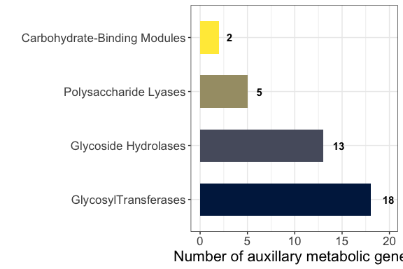<!-- -->

``` r
# no NIF genes, etc
amg.plotdata %>%
    filter(category == "Organic Nitrogen") %>%
    ggplot(aes(x = module, fill = module, y = n)) + theme_bw() +
    geom_bar(stat = "identity", position = "stack", width = 0.6) +
    coord_flip() + scale_fill_viridis_d(option = "C", direction = -1) +
    ylab("Number of auxillary metabolic genes") + xlab("") +
    theme(legend.position = "none") + scale_x_discrete(limits = rev)
```

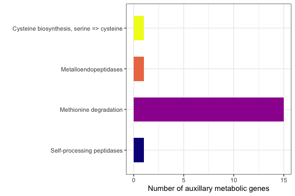<!-- -->

``` r
# Only one MAG - virus connection (HQ)
checkv_dRep_tax_combo_high %>%
    left_join(host_predictions[-c(9:19)], by = c(GenomeID = "Virus")) %>%
    group_by(`Bin ID`) %>%
    tally()
```

    ## # A tibble: 2 × 2
    ##   `Bin ID`     n
    ##   <chr>    <int>
    ## 1 SGMAG-05     1
    ## 2 <NA>       427

``` r
# MAG distribution plot
mag_plot <- mag_info %>%
    separate_wider_delim(cols = `GTDB-Tk classification`, delim = ";",
        names = c("Domain", "Phylum", "Class", "Order", "Family",
            "Genus", "Species"), too_few = "align_start") %>%
    mutate_all(., str_replace, "d__|p__|c__|o__|f__|g__|s__",
        "") %>%
    group_by(Class) %>%
    tally() %>%
    arrange(desc(n)) %>%
    group_by(Class) %>%
    mutate(n2 = sum(n)) %>%
    mutate(lab_ypos = n2 + 2) %>%
    ggplot(aes(x = Class, fill = Class, y = n)) + theme_bw() +
    geom_bar(stat = "identity", position = "stack", width = 0.6) +
    scale_fill_viridis_d(option = "B") + ylab("Number of MAGs") +
    xlab("") + theme(legend.position = "none") + coord_flip() +
    scale_x_discrete(limits = rev) + geom_text(aes(y = lab_ypos,
    label = n, group = Class), fontface = "bold", size = 4, color = "black") +
    theme(text = element_text(size = 16))
```

``` r
# phage vs. prophage

checkv_cdhit_tax.meta.pro <- checkv_dRep_tax_combo_high %>%
    group_by(provirus) %>%
    tally()

checkv_cdhit_tax.meta.pro <- checkv_cdhit_tax.meta.pro %>%
    arrange(desc(provirus)) %>%
    mutate(lab_ypos = n + 0.05 * sum(n))

# Provirus plot
b_provir <- ggplot(checkv_cdhit_tax.meta.pro, aes(x = provirus,
    fill = provirus, y = n)) + geom_bar(stat = "identity", position = "stack",
    width = 0.6) + scale_fill_manual(values = c("black", "grey75")) +
    ylab("Number of viral sequences") + theme(plot.title = element_text(hjust = 0.5,
    vjust = 0.5, face = "bold"), axis.text.x = element_text(angle = 0,
    hjust = 0.5, vjust = 0)) + xlab("Proviral Status") + theme(legend.position = "none") +
    geom_text(aes(y = lab_ypos, label = n, group = provirus),
        fontface = "bold", size = 4, color = "black") + theme(text = element_text(size = 16))


# quality of sequences

checkv_cdhit_tax.meta.qual <- checkv_dRep_tax_combo_high %>%
    group_by(checkv_quality) %>%
    tally() %>%
    arrange(desc(n)) %>%
    mutate(lab_ypos = n + 0.03 * sum(n))


checkv_cdhit_tax.meta.qual$checkv_quality <- factor(checkv_cdhit_tax.meta.qual$checkv_quality,
    levels = c("Complete", "High-quality", "Medium-quality",
        "Low-quality", "Not-determined"))

# Quality plot
c_qual <- ggplot(checkv_cdhit_tax.meta.qual, aes(x = checkv_quality,
    fill = checkv_quality, y = n)) + geom_bar(stat = "identity",
    position = "stack", width = 0.6) + scale_fill_viridis_d(option = "B",
    direction = -1, end = 0.8, begin = 0.2) + ylab("Number of viral sequences") +
    theme(plot.title = element_text(hjust = 0.5, vjust = 0.5,
        face = "bold"), axis.text.x = element_text(angle = 0,
        hjust = 0.5, vjust = 0)) + xlab("CheckV Quality") + theme(legend.position = "none") +
    geom_text(aes(y = lab_ypos, label = n, group = checkv_quality),
        fontface = "bold", size = 4, color = "black") + theme(text = element_text(size = 16))

b_provir + c_qual + plot_annotation(tag_levels = "A")  #+ plot_layout(guides = 'collect')
```

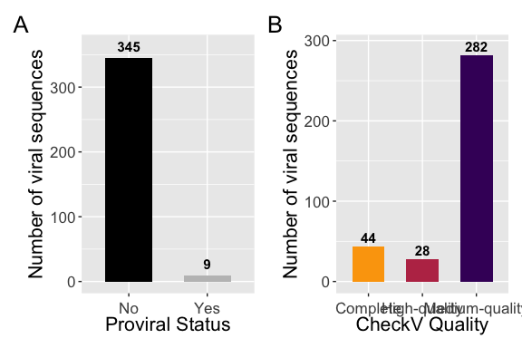<!-- -->

``` r
ggsave(filename = "../plots/highQstats.pdf", plot = last_plot(),
    device = "pdf", width = 7, height = 4, dpi = 300)
ggsave(filename = "../plots/highQstats.png", plot = last_plot(),
    device = "png", width = 7, height = 4, dpi = 300)


checkv_cdhit_tax.meta.tax <- checkv_dRep_tax_combo_high %>%
    group_by(Class) %>%
    tally() %>%
    arrange(desc(n)) %>%
    group_by(Class) %>%
    mutate(n2 = sum(n)) %>%
    mutate(lab_ypos = n2 + 15)

# Taxonomy plot
plot_tax <- ggplot(checkv_cdhit_tax.meta.tax, aes(x = Class,
    fill = Class, y = n)) + geom_bar(stat = "identity", position = "stack",
    width = 0.6) + scale_fill_manual(values = c(RColorBrewer::brewer.pal(8,
    "Set2")[c(2:5)], "slateblue4", RColorBrewer::brewer.pal(8,
    "Set2")[c(6)], "grey 75")) + ylab("Number of viral sequences") +
    xlab("") + theme(legend.position = "none") + geom_text(aes(y = lab_ypos,
    label = n2, group = Class), fontface = "bold", size = 4,
    color = "black") + coord_flip() + scale_x_discrete(limits = rev) +
    theme(text = element_text(size = 16))

plot_tax
```

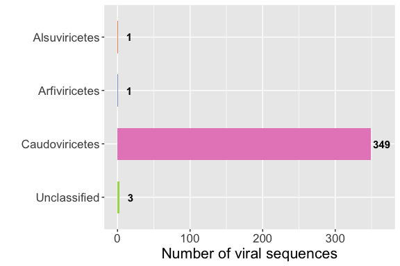<!-- -->

``` r
# Exploring viral diversity
votus.high <- unique(na.omit(checkv_dRep_tax_combo_high$votu.id))

# Prune samples to focus only on high quality viral
# sequences
ps.HQ <- prune_taxa(votus.high, ps)

# See detection level across samples
sample_sums(ps.HQ)
```

    ##     CE_108A     CE_109A     CE_140A  ERR3624084  ERR3624086  ERR3624088 
    ##  508.464073  608.866964  526.067134  256.605647  431.536326   52.420734 
    ##  ERR3624090  ERR3624092  ERR3624094  ERR3624096  ERR3624098  ERR3624100 
    ##  880.110718  505.912931  167.507070  256.361605   98.690830  173.977570 
    ##  ERR4579589  ERR4579590  ERR4579591  ERR4579594 SRR12681089 SRR15353278 
    ##    0.000000    7.593337    0.000000    0.000000 9508.440296    0.000000 
    ## SRR15353279 SRR15353280 SRR15353281 SRR15353282 SRR15353283 SRR15353284 
    ##    0.000000    4.385342    0.000000    0.000000    0.000000    0.000000 
    ## SRR15353285 SRR15353286 SRR15353287 SRR15353289 SRR15353291 SRR15353292 
    ##    0.000000    1.996399    0.000000    8.084774    0.000000    0.000000 
    ## SRR15353293 SRR15353294 SRR15353295 SRR17220965 SRR17220966 SRR17220967 
    ##    0.000000    0.000000    3.108577   16.286613  348.920066  589.282643 
    ## SRR17220968 SRR17220969 SRR17220970 SRR17220971 SRR17220972 SRR17220977 
    ##   72.438847   51.974780   69.019145    4.777195  123.927319   77.456417 
    ## SRR17220978 SRR17220979 SRR18245246 SRR18245247 SRR18245248 SRR18245251 
    ##  212.647037  359.244678  223.865363  375.974580   13.242913    0.000000 
    ## SRR18245252 SRR18245253  SRR6310506  SRR6310507  SRR6310508  SRR6310509 
    ##  212.960156  159.964026  152.188570    0.000000  370.469670    0.000000 
    ##  SRR6350024  SRR6350025  SRR6876836  SRR6876837  SRR6876838  SRR6876840 
    ##   23.623573    0.000000    0.000000    0.000000    0.000000    0.000000 
    ##  SRR6876841  SRR6876842  SRR6876843  SRR6876844  SRR6876845  SRR6876848 
    ##    0.000000    0.000000    0.000000    0.000000    0.000000    0.000000 
    ##  SRR6876849 
    ##    0.000000

``` r
# Remove samples with < 5 viral sequences after quality
# filtering
ps.HQ <- prune_samples(sample_sums(ps.HQ) > 20, ps.HQ)

ps_hell <- transform(ps.HQ, "hellinger")

ps_hell_ord <- ordinate(physeq = ps_hell, method = "PCoA", distance = "euclidean")

# Beta-diversity plot
ord_plot <- plot_ordination(physeq = ps_hell, ordination = ps_hell_ord,
    color = "CitationID", shape = "Tissue") + geom_point(size = 3) +
    theme(text = element_text(size = 16)) + scale_color_manual(values = c("#440154FF",
    "#46337EFF", "#FDE725FF", "#277F8EFF", "#4AC16DFF", "#365C8DFF",
    "black")) + labs(color = "Study", shape = "Sample type") +
    xlab(paste0("PCoA 1: ", round(100 * ps_hell_ord$values$Relative_eig[1],
        1), "% variance")) + ylab(paste0("PCoA 2: ", round(100 *
    ps_hell_ord$values$Relative_eig[2], 1), "% variance"))


ord_plot
```

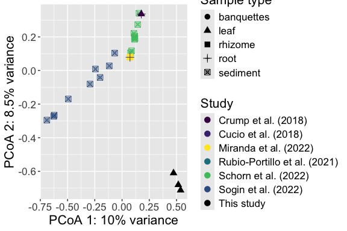<!-- -->

``` r
# Alpha diversity plot
plot_richness(ps.HQ, measures = c("Shannon"), color = "CitationID",
    shape = "Tissue")
```

    ## Warning in estimate_richness(physeq, split = TRUE, measures = measures): The data you have provided does not have
    ## any singletons. This is highly suspicious. Results of richness
    ## estimates (for example) are probably unreliable, or wrong, if you have already
    ## trimmed low-abundance taxa from the data.
    ## 
    ## We recommended that you find the un-trimmed data and retry.

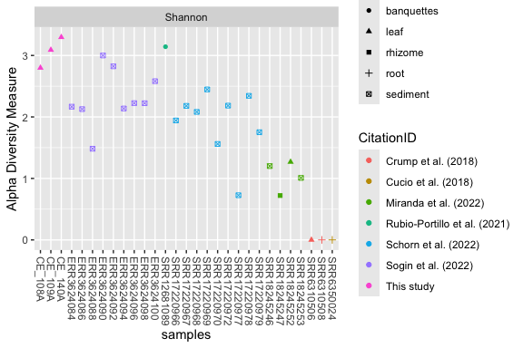<!-- -->

``` r
# Origin plot
meta.sub <- meta %>%
    select(Filename, CitationID) %>%
    unique()

total.viral.seq.leng <- checkv_dRep_tax_combo %>%
    mutate(filename.x = ifelse(filename.x == "Rubio_Protillo",
        "Rubio-Portillo", as.character(filename.x))) %>%
    left_join(meta.sub, by = c(filename.x = "Filename")) %>%
    group_by(CitationID) %>%
    tally()

hq.viral.seq.leng <- checkv_dRep_tax_combo_high %>%
    mutate(filename.x = ifelse(filename.x == "Rubio_Protillo",
        "Rubio-Portillo", as.character(filename.x))) %>%
    left_join(meta.sub, by = c(filename.x = "Filename")) %>%
    group_by(CitationID) %>%
    tally()

stud_meta <- vroom("../data/study_meta_plotting.txt") %>%
    unique()
```

    ## Rows: 11 Columns: 3
    ## ── Column specification ────────────────────────────────────────────────────────
    ## Delimiter: "\t"
    ## chr (3): CitationID, Tissue, Species
    ## 
    ## ℹ Use `spec()` to retrieve the full column specification for this data.
    ## ℹ Specify the column types or set `show_col_types = FALSE` to quiet this message.

``` r
lengths_to_plot <- left_join(total.viral.seq.leng, hq.viral.seq.leng,
    by = c("CitationID")) %>%
    mutate(n.y = ifelse(is.na(n.y), 0, n.y)) %>%
    left_join(stud_meta, by = c("CitationID")) %>%
    unique() %>%
    pivot_longer(cols = c(n.x, n.y), names_to = "Quality", values_to = "Count") %>%
    mutate_at("Quality", str_replace, "n.x", "Total") %>%
    mutate_at("Quality", str_replace, "n.y", "High quality") %>%
    mutate(Quality = factor(Quality, levels = c("Total", "High quality"))) %>%
    filter(Quality == "High quality") %>%
    mutate(Tissue = factor(Tissue, levels = c("sediment", "plant tissue",
        "both"))) %>%
    arrange(desc(Count)) %>%
    mutate(lab_ypos = Count + 0.015 * sum(Count))


origin_plot <- ggplot(lengths_to_plot, aes(x = Count, y = CitationID,
    fill = Tissue)) + geom_bar(orientation = "y", stat = "identity",
    position = "stack", width = 0.6) + xlab("Number of viral sequences") +
    ylab("") + scale_fill_viridis_d(option = "D", begin = 0.25,
    direction = -1) + guides(fill = guide_legend(title = "Sample type")) +
    scale_y_discrete(limits = rev) + geom_text(aes(x = lab_ypos,
    label = Count, group = CitationID), fontface = "bold", size = 4,
    color = "black") + theme(text = element_text(size = 16))
#+ facet_wrap(~ Quality, scales = 'free')
origin_plot
```

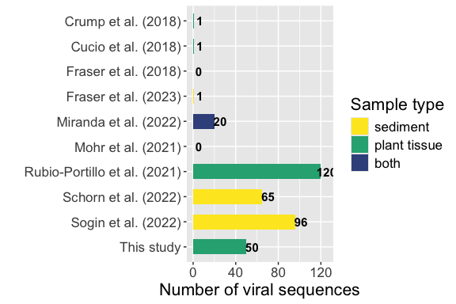<!-- -->

``` r
# Figure 1
(b_provir + c_qual)/(origin_plot + ord_plot) + plot_annotation(tag_levels = "A")
```

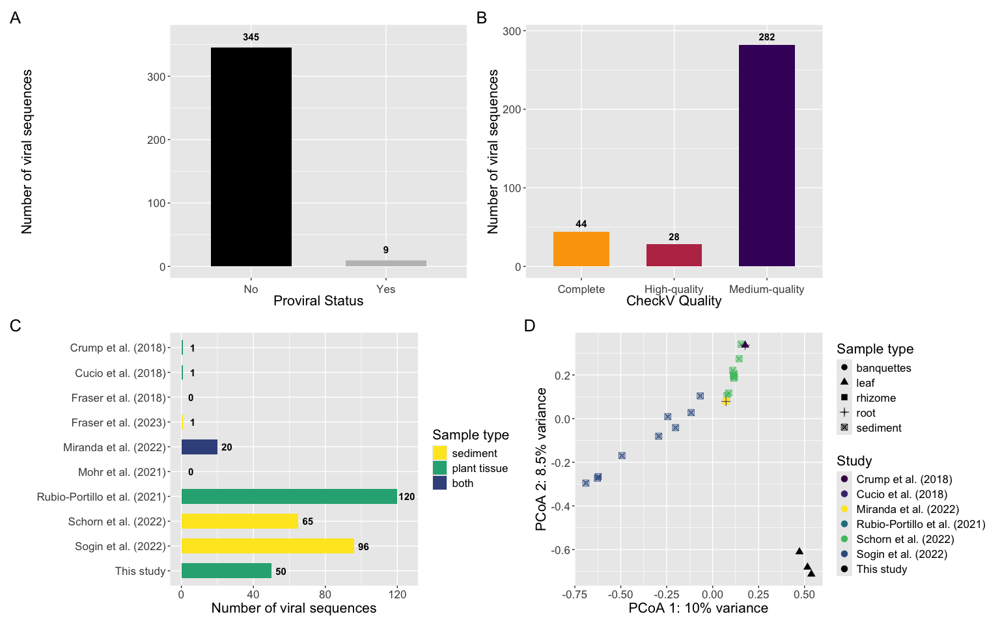<!-- -->

``` r
ggsave(filename = "../plots/figure1.pdf", plot = last_plot(),
    device = "pdf", width = 16, height = 10, dpi = 300)
ggsave(filename = "../plots/figure1.png", plot = last_plot(),
    device = "png", width = 16, height = 10, dpi = 300)

# Figure 2
(mag_plot + host_plot)/(amg_general + amg_cazy) + plot_annotation(tag_levels = "A")
```

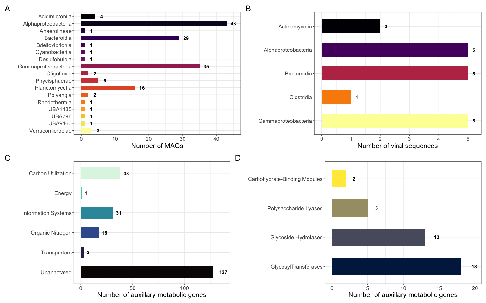<!-- -->

``` r
ggsave(filename = "../plots/figure2.pdf", plot = last_plot(),
    device = "pdf", width = 16, height = 10, dpi = 300)
ggsave(filename = "../plots/figure2.png", plot = last_plot(),
    device = "png", width = 16, height = 10, dpi = 300)

# Figure S1
ntwk.p + plot_tax + plot_annotation(tag_levels = "A")
```

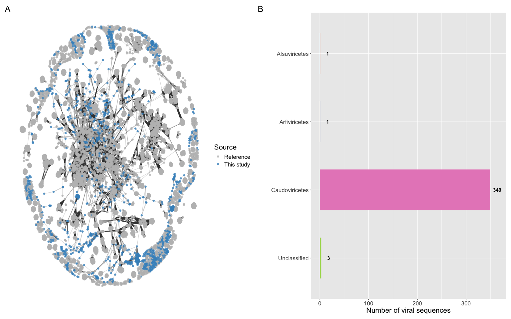<!-- -->

``` r
ggsave(filename = "../plots/figures1.pdf", plot = last_plot(),
    device = "pdf", width = 14, height = 6, dpi = 300)
ggsave(filename = "../plots/figures1.png", plot = last_plot(),
    device = "png", width = 14, height = 6, dpi = 300)
```
